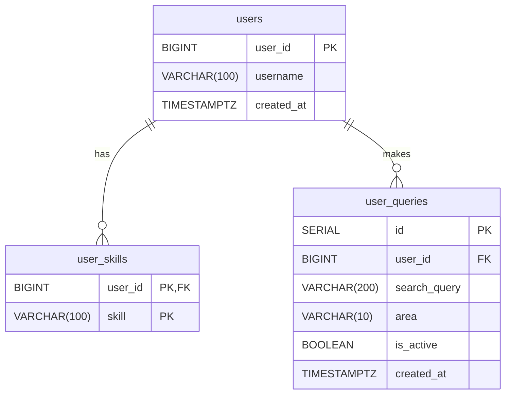

# HuntRadar Bot

HuntRadar Bot is a microservice-based system that:

* collects job vacancies from hh.kz based on user-defined search queries;
* extracts and normalizes skills;
* evaluates vacancy relevance for a specific user;
* sends matching job recommendations via Telegram.

The project consists of three core microservices (`parser-service`, `matcher-service`, `bot-service`) and supporting infrastructure (`PostgreSQL`, `Redis`, `Kafka`).

---

# 1. Architecture

## 1.1 Services

### `bot-service`

* Telegram bot built with `aiogram`.
* User onboarding (skills, search query, region).
* Profile editing and notification management.
* Receives processed recommendations from Kafka and delivers them to Telegram users.

### `parser-service`

* Periodically reads active user queries from PostgreSQL.
* Fetches vacancies from the hh.kz API.
* Deduplicates vacancies using Redis (to avoid duplicate notifications).
* Publishes raw vacancies to the Kafka topic `vacancies.raw`.

### `matcher-service`

* Subscribed to `vacancies.raw`.
* Extracts skills from vacancy descriptions.
* Compares vacancy skills with user skills using embeddings and cosine similarity.
* Generates recommendations and publishes them to `vacancies.ready`.

## 1.2 Infrastructure

* **PostgreSQL** — stores users, skills, and search queries.
* **Redis** — vacancy deduplication cache and recent history storage.
* **Kafka** — event transport layer between microservices.

## 1.3 End-to-End Data Flow

1. User completes `/start` onboarding in the Telegram bot.
2. `bot-service` stores:

   * user information in `users`;
   * skills in `user_skills`;
   * active search query in `user_queries`.
3. `parser-service` periodically reads active `user_queries`.
4. `parser-service` retrieves vacancies from hh.kz, filters already-seen vacancies via Redis, and publishes new ones to `vacancies.raw`.
5. `matcher-service` consumes `vacancies.raw` and evaluates vacancy relevance for each `user_id`.
6. Matching vacancies are published to `vacancies.ready`.
7. `bot-service` consumes `vacancies.ready`, sends recommendations to users, and stores notification history in Redis.

---

# 2. Database

Database initialization is performed via `init.sql`.

## 2.1 Tables

### `users`

* `user_id BIGINT PRIMARY KEY`
* `username VARCHAR(100)`
* `created_at TIMESTAMPTZ`

### `user_skills`

* `user_id BIGINT` (FK → `users.user_id`)
* `skill VARCHAR(100)`
* Primary Key: (`user_id`, `skill`)

### `user_queries`

* `id SERIAL PRIMARY KEY`
* `user_id BIGINT` (FK → `users.user_id`)
* `search_query VARCHAR(200)`
* `area VARCHAR(10)` (default: `40`)
* `is_active BOOLEAN` (default: `TRUE`)
* `created_at TIMESTAMPTZ`
* Index: `idx_user_queries_active` for fast retrieval of active queries.



## 2.2 Query Storage Logic

When a user updates their search query, the previous record is not deleted. Instead, it is marked as inactive (`is_active = FALSE`), and a new active record is created. This provides a simple audit trail of query changes.

---

# 3. Kafka Topics and Contracts

## 3.1 `vacancies.raw`

Published by `parser-service`.

Contains raw vacancy data along with the list of users associated with the search query.

Main payload fields:

* `vacancy_id`
* `title`
* `description`
* `url`
* `employer`
* `area`
* `salary_from`
* `salary_to`
* `currency`
* `published_at`
* `key_skills`
* `user_ids` (list of subscribed users)
* `search_query`

## 3.2 `vacancies.ready`

Published by `matcher-service`.

Contains personalized recommendations.

Main payload fields:

* `user_id`
* `vacancy_id`
* `title`
* `url`
* `score`
* `verdict`
* `message_text` (ready-to-send Telegram message)
* `missing_skills`

---

# 4. Microservices in Detail

## 4.1 `bot-service`

Main files:

* `main.py`
* `handlers/onboarding.py`
* `handlers/profile.py`
* `vacancy_sender.py`
* `db.py`
* `rd_cache.py`

### Responsibilities

* Runs Telegram polling.
* Runs a Kafka consumer for `vacancies.ready` in parallel.
* Handles user FSM flows (onboarding, profile editing, notifications).
* Sends vacancy cards and stores the last 5 delivered vacancies in Redis.

### Onboarding Flow

1. `/start`

   * `register_user(...)`
   * If the user already has skills configured, show the main menu immediately.
2. Skill input

   * User enters skills separated by commas.
   * `extract_skills_from_user_input(...)` normalizes and maps them to canonical names.
3. Search query input.
4. Region selection (`area:40`, `area:113`, `area:all`).
5. Save data to the database:

   * `save_user_skills(...)`
   * `save_user_query(...)`

### Vacancy Delivery Flow

1. Consumer reads from `vacancies.ready`.
2. For each payload:

   * Validates `message_text`.
   * Sends a Telegram message with inline buttons (`Open Vacancy`, `Good`, `Bad`).
   * Stores delivery history in Redis using `LPUSH`, `LTRIM 0..4`, with a TTL of 3 days.

---

## 4.2 `parser-service`

Main files:

* `main.py`
* `hh_client.py`
* `db.py`
* `redis_cache.py`

### Responsibilities

* Runs parsing cycles at a configurable interval (`PARSE_INTERVAL_SEC`).
* Groups identical user queries (`search_query + area`).
* Retrieves vacancies from hh.kz.
* Fetches detailed vacancy information.
* Publishes only new vacancies using Redis-based deduplication.

### `parse_cycle` Algorithm

1. Reads active queries via `get_active_user_queries()`.
2. Builds:

```python
unique_queries: dict[(search_query, area)] -> [user_ids]
```

3. For each unique query:

   * Calls `process_query(...)`.
   * Waits `REQUEST_DELAY_SEC` between requests.

### `process_query` Algorithm

1. `fetch_vacancies(...)`
2. For each vacancy:

   * If `is_seen(vacancy_id)` → skip.
   * Otherwise fetch details via `fetch_vacancy_detail(...)`.
   * Normalize using `parse_vacancy(...)`.
   * Publish to `vacancies.raw`.
   * Mark as seen using Redis (`mark_seen(...)`) with a TTL of 7 days.

### HH.kz Rate-Limit Protection

* On `429 Too Many Requests`:

  * Reads the `Retry-After` header.
  * Waits and retries.
* On `400 Bad Request`:

  * Logs the response body.
  * Returns an empty result.

---

## 4.3 `matcher-service`

Main files:

* `main.py`
* `skill_extractor.py`
* `scorer.py`
* `embedder.py`
* `recommender.py`
* `db.py`

### Responsibilities

* Consumes raw vacancies from `vacancies.raw`.
* Extracts skills from vacancy descriptions.
* Calculates match scores for each user.
* Publishes recommendations to `vacancies.ready`.

### Skill Extraction Algorithm

1. Text normalization (`normalize_text`)

   * lowercase conversion;
   * HTML removal;
   * special character cleanup;
   * whitespace normalization.
2. Sentence splitting (`split_into_sentences`) for context analysis.
3. Skill detection using alias dictionaries (`SKILLS_DICT`) and regular expressions.
4. Weight assignment:

   * `1.0` for required skills;
   * `0.5` for skills found in sentences containing "nice-to-have" markers.
5. Deduplication:

   * Retains the highest weight for each canonical skill.

### Scoring Algorithm

Uses `sentence-transformers/all-MiniLM-L6-v2`
(384-dimensional L2-normalized embeddings).

1. For each vacancy skill, find the best matching user skill using cosine similarity.
2. A match is considered valid when:

```python
similarity >= 0.75
```

3. Final score:

```python
sum(weights_matched) / sum(weights_total)
```

4. Verdict:

   * `full_match` if `score >= 0.75`
   * `partial_match` if `0.2 <= score < 0.75`
   * `no_match` if `score < 0.2`

5. `missing_skills` contains only unmatched required skills (`weight = 1.0`).

### Recommendation Generation

`build_recommendation_message(...)` creates an HTML-formatted Telegram message containing:

* match type (`full` / `partial`);
* company, location, and salary information;
* extracted key skills;
* for partial matches:

  * missing skills;
  * personalized learning suggestions (`LEARNING_TIPS`).

---

# 5. Redis Keys

### `parser-service`

* `seen:{vacancy_id}`

  * Vacancy deduplication.
  * TTL: 7 days.

### `bot-service`

* `user:{user_id}:history`

  * Stores the last 5 delivered vacancies.
  * TTL: 3 days.

---

# 6. Environment Variables

## Common

* `KAFKA_BOOTSTRAP_SERVERS` (default: `kafka:9092`)
* `DATABASE_URL`
* `REDIS_URL` (required by `parser-service` and `bot-service`)

## Parser

* `HH_APP_TOKEN`
* `REQUEST_DELAY_SEC` (default: `1.0`)
* `PARSE_INTERVAL_SEC` (default: `900`, set to `300` in Docker Compose)

## Bot

* `BOT_TOKEN`

---

# 7. Running the Project

1. Create a `.env` file in the project root:

```env
HH_APP_TOKEN=...
BOT_TOKEN=...
```

2. Start the system:

```bash
docker compose up --build
```

After startup:

* the Telegram bot accepts `/start`;
* the parser begins scheduled search cycles;
* the matcher publishes matching recommendations;
* the bot delivers job recommendations to users.

---

# 8. Technology Stack

* Python 3.11+ (Docker containers)
* `aiogram` (Telegram bot framework)
* `aiohttp` (HTTP client)
* `aiokafka` (Kafka producer/consumer)
* `SQLAlchemy Async` + `asyncpg` (PostgreSQL)
* `redis[asyncio]` (cache and history storage)
* `sentence-transformers` + `numpy` (semantic skill matching)
* Docker Compose (local orchestration)
